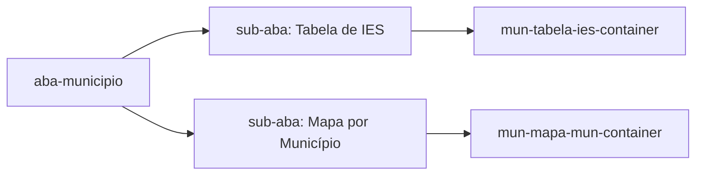

# Design Document — Melhorias na Aba "Visão por Município"

## Overview

Este documento descreve o design técnico para a implementação dos 12 requisitos de melhoria da aba `aba-municipio` do Dashboard de Educação Superior (INEP/FUNASA), construído com Plotly Dash em Python.

O escopo é restrito ao arquivo `dash_educacao_superior.py`. As mudanças são incrementais e não alteram o modelo de dados de origem (Trino) nem a estrutura de abas do dashboard. A abordagem adotada prioriza:

- Mínimo de dependências externas novas (apenas `openpyxl` opcional para exportação Excel)
- Compatibilidade com o padrão de callbacks Dash existente (Input/Output/State)
- Separação clara de lógica de filtro, agregação e renderização dentro dos callbacks
- Preservação do comportamento das demais abas

---

## Architecture

### Visão Geral de Componentes

```mermaid
graph TD
    subgraph "Dash App (dash_educacao_superior.py)"
        A[dcc.Location + dcc.Store] --> B[_aba_municipio_layout()]
        B --> C[Filtros: UF / Município / Ano / Categoria / Modalidade]
        B --> D[dcc.Tabs internos: Tabela de IES / Mapa por Município]
        D --> E[Sub-aba Tabela de IES]
        D --> F[Sub-aba Mapa por Município]
        E --> G[mun-tabela-ies-container]
        E --> H[mun-detalhe-ies-container]
        H --> I[Filtros de Curso: busca / modalidade / grau / área]
        H --> J[Tabela_Cursos + Totais + Export]
        F --> K[go.Scattermap]
    end

    subgraph "Browser"
        L[Nova aba: /educacao-superior/ies?co_ies=...&uf=...&municipio=...&ano=...]
    end

    H -- Req 2: window.open via dcc.Location / clientside callback --> L
```

### Estratégia de URL para Nova Aba (Req 2)

O Dash não tem mecanismo nativo de `window.open`. A solução adota um **clientside callback** que recebe como Output um componente `html.A` com `target="_blank"` ou, alternativamente, usa `dcc.Location` + uma rota dedicada `/ies` para renderizar o Painel_Detalhe isolado.

A rota `/ies` é declarada via `suppress_callback_exceptions=True` (já habilitado) e sua URL segue o padrão:

```
/educacao-superior/ies?co_ies=<co_ies>&uf=<sg_uf>&municipio=<no_municipio>&ano=<nu_ano_censo>
```

### Ordenação da Tabela_IES (Req 1)

A Tabela_IES hoje é um `html.Table` estático. A ordenação será implementada via:
- Um `dcc.Store(id="mun-sort-state")` que persiste `{"col": "total_mat", "asc": False}`
- Cabeçalhos com `id={"type": "th-sort-ies", "col": <nome_col>}` clicáveis (callbacks pattern-matching)
- O callback `renderizar_tabela_faculdades()` lê o store de sort e aplica `.sort_values()` no DataFrame antes de construir as linhas

### Filtros de Cursos no Painel_Detalhe (Req 3, 5, 8)

O Painel_Detalhe adquire quatro controles de filtro acima da Tabela_Cursos:
- `dcc.Input(id="mun-curso-busca")` — busca textual
- `dcc.Dropdown(id="mun-curso-modal")` — modalidade
- `dcc.Dropdown(id="mun-curso-grau")` — grau acadêmico
- `dcc.Dropdown(id="mun-curso-area")` — área CINE

Um novo callback `filtrar_tabela_cursos()` recebe esses controles + o `dcc.Store` da IES selecionada e reconstrói a Tabela_Cursos. O DataFrame numérico é mantido intacto durante a filtragem; a formatação `_fmt_mil()` é aplicada apenas na renderização final.

### Sub-abas Internas (Req 11)



O layout da aba passa a conter `dcc.Tabs(id="mun-sub-abas")` antes dos containers de saída. O callback de roteamento de sub-aba (`renderizar_sub_aba_municipio`) controla qual container é visível.

---

## Components and Interfaces

### Novos `dcc.Store`

| ID | Dado armazenado | Tipo |
|----|----------------|------|
| `mun-sort-state` | `{"col": str, "asc": bool}` | `dict` |
| `mun-ies-selecionada` | `co_ies` (já existe) | `str \| None` |
| `mun-curso-filtros` | `{"busca": str, "modal": str, "grau": str, "area": str}` | `dict` |

### Novos Componentes de Layout em `_aba_municipio_layout()`

```python
# Filtros adicionais (Req 10)
_filtro_label("Categoria Adm.", "mun-categoria", CATEGORIAS_ADM, "Todas", 220)
_filtro_label("Modalidade",     "mun-modalidade", ["Todas", "Presencial", "EAD"], "Todas", 160)

# Sub-abas internas (Req 11)
dcc.Tabs(id="mun-sub-abas", value="sub-tabela", children=[
    dcc.Tab(label="Tabela de IES",      value="sub-tabela"),
    dcc.Tab(label="Mapa por Município", value="sub-mapa"),
])

# Limpeza do dropdown de município (Req 9)
dcc.Dropdown(id="mun-municipio", clearable=True, ...)

# Opção "Todos os Municípios" (Req 7)
# Inserida como primeira opção no callback atualizar_municipios_por_uf()
```

### Novo Componente de Rota `/ies` (Req 2)

```python
# Adicionado ao layout raiz
dcc.Location(id="url", refresh=False)

# Rota dedicada para o Painel_Detalhe isolado
# Renderizada pelo callback renderizar_pagina_ies() quando pathname == "/educacao-superior/ies"
```

### Constante `CATEGORIA_ADM_MAP` (Req 12)

```python
CATEGORIA_ADM_MAP = {
    1: "Pública Federal",
    2: "Pública Estadual",
    3: "Pública Municipal",
    4: "Privada c/ fins lucrativos",
    5: "Privada s/ fins lucrativos",
    7: "Especial",
}
CATEGORIAS_ADM = ["Todas"] + list(CATEGORIA_ADM_MAP.values())
```

### Botões de Exportação (Req 6)

```python
# No topo do card de detalhes
html.Div([
    html.Button("Exportar CSV",   id="mun-btn-export-csv",   ...),
    html.Button("Exportar Excel", id="mun-btn-export-xlsx",  ...),  # condicional
    dcc.Download(id="mun-download"),
])
```

O callback `exportar_cursos()` usa `dcc.send_data_frame()` para CSV e `dcc.send_bytes()` para Excel.

### Mapa de Pontos (Req 11)

```python
go.Scattermap(
    lat=df_mun["lat"],
    lon=df_mun["lon"],
    mode="markers",
    marker=dict(size=df_mun["size_norm"], color=df_mun["Valor"], colorscale="Blues"),
    hovertemplate="<b>%{text}</b><br>...",
    text=df_mun["no_municipio"],
)
```

As coordenadas são obtidas a partir da tabela de geocódigos IBGE (CSV público) carregada uma única vez no startup via `_carregar_coordenadas_municipios()`.

---

## Data Models

### DataFrame `df_cursos` — colunas relevantes para as novas funcionalidades

| Coluna | Tipo | Uso |
|--------|------|-----|
| `co_ies` | str/int | Join com df_ies, chave de filtragem |
| `sg_uf` | str | Filtro de UF |
| `no_municipio` | str | Filtro de município |
| `nu_ano_censo` | int | Filtro de ano |
| `tp_modalidade_ensino` | str | Filtro Req 10 / dropdown Req 3 |
| `tp_grau_academico` | str | Dropdown Req 3 |
| `no_cine_area_geral` | str | Dropdown Req 3 (área) |
| `no_curso` | str | Busca textual Req 3 |
| `qt_mat_fies` | float | Soma direta Req 4 |
| `qt_mat_prounii` | float | Soma direta Req 4 |
| `qt_mat_prounip` | float | Soma direta Req 4 |
| `qt_ing_enem` | float | Soma direta Req 4 |
| `co_municipio` | int | Geocódigo IBGE para mapa Req 11 |

### DataFrame `df_ies` — colunas relevantes

| Coluna | Tipo | Uso |
|--------|------|-----|
| `co_ies` | str/int | Chave |
| `tp_categoria_administrativa` | int | Mapeamento Req 12, filtro Req 10 |
| `tp_rede` | str | Exibição no cabeçalho Req 12 |
| `sg_uf_ies` | str | Filtro |
| `no_municipio_ies` | str | Filtro |

### Tabela de Coordenadas Municipais (`_df_coords`)

Carregada de `https://raw.githubusercontent.com/kelvins/municipios-brasileiros/main/csv/municipios.csv` no startup e cacheada em `.cache/municipios_coords.csv`.

| Coluna | Tipo | Descrição |
|--------|------|-----------|
| `codigo_ibge` | int | Mapeia para `co_municipio` |
| `nome` | str | Nome do município |
| `latitude` | float | Centróide aproximado |
| `longitude` | float | Centróide aproximado |
| `uf` | str | Sigla da UF |

### Estado de Ordenação `mun-sort-state`

```python
{
  "col": "total_mat",  # nome da coluna de dados (não rótulo da tabela)
  "asc": False         # True = crescente
}
```

Colunas de dados aceitas: `"total_mat"`, `"total_ing"`, `"total_conc"`, `"total_cursos"`.

### Agregação de `df_cursos_tab` (Req 4 — correção FIES)

A agregação é feita em **duas etapas separadas** para garantir que o total de FIES no card "Perfil dos Alunos" coincida com a soma na Tabela_Cursos:

```python
# Etapa 1 — totais para KPIs (soma direta antes de qualquer groupby)
fies_total = int(df_c["qt_mat_fies"].sum())

# Etapa 2 — tabela agrupada (soma dentro de cada grupo)
df_cursos_tab = df_c.groupby(
    ["no_curso", "tp_modalidade_ensino", "tp_grau_academico", "no_cine_area_geral"],
    dropna=False
).agg(FIES=("qt_mat_fies", "sum"), ...).reset_index()

# Linha de totais (Req 5)
total_row = df_cursos_tab[numeric_cols].sum()
```

Desta forma, `fies_total` (card) e `df_cursos_tab["FIES"].sum()` são sempre iguais, pois ambos partem de `df_c["qt_mat_fies"].sum()` sem deduplicação.

---

## Correctness Properties

*Uma propriedade é uma característica ou comportamento que deve ser verdadeiro em todas as execuções válidas do sistema — essencialmente, uma declaração formal sobre o que o sistema deve fazer. As propriedades servem como ponte entre especificações legíveis por humanos e garantias de correção verificáveis por máquinas.*

### Property 1: Ordenação crescente e decrescente são inversas entre si

*Para qualquer* lista de IES com valores numéricos em qualquer coluna ordenável (Matrículas, Ingressantes, Concluintes, Cursos Únicos), aplicar ordenação crescente e depois decrescente sobre os mesmos dados deve produzir a lista exatamente invertida da ordenação crescente, e os valores devem ser comparados numericamente (não como strings formatadas).

**Validates: Requirements 1.1, 1.2, 1.5**

### Property 2: Filtros aplicam interseção estrita

*Para qualquer* combinação de filtros ativos — incluindo busca textual em `no_curso`, modalidade em `tp_modalidade_ensino`, grau em `tp_grau_academico`, área em `no_cine_area_geral`, categoria administrativa e modalidade a nível de IES — toda linha retornada deve satisfazer simultaneamente todos os critérios cujo valor não seja "Todas" / "Todos". Nenhuma linha que viole qualquer critério ativo deve aparecer no resultado.

**Validates: Requirements 3.5, 10.3, 10.4, 10.6**

### Property 3: Linha de totais é igual à soma das linhas visíveis

*Para qualquer* subconjunto de cursos resultante de filtragem (incluindo o caso sem filtros e o caso com todos os filtros combinados), o valor exibido em cada célula numérica da linha de totais deve ser igual à soma aritmética exata dos valores correspondentes nas linhas visíveis. As colunas de texto devem retornar "—" na linha de totais.

**Validates: Requirements 3.7, 5.1, 5.3, 5.4**

### Property 4: Exportação CSV preserva exatamente o conteúdo filtrado

*Para qualquer* estado de filtros ativos na Tabela_Cursos, o arquivo CSV exportado deve conter exatamente as mesmas linhas que estão visíveis na tabela — nem mais, nem menos — com os mesmos valores e o mesmo cabeçalho de colunas.

**Validates: Requirements 6.2, 6.5**

### Property 5: Indicadores de financiamento são consistentes entre card e tabela

*Para qualquer* IES e ano selecionados, e para cada uma das colunas de financiamento (`qt_mat_fies`, `qt_mat_prounii`, `qt_mat_prounip`, `qt_ing_enem`), a soma direta sobre o DataFrame filtrado por `co_ies` e `nu_ano_censo` deve ser igual à soma da coluna correspondente na Tabela_Cursos agrupada, e ambas devem ser iguais ao valor exibido no card "Perfil dos Alunos".

**Validates: Requirements 4.1, 4.2, 4.3, 4.5**

### Property 6: Numeração da coluna "#" é sequencial e sem lacunas após qualquer filtragem

*Para qualquer* estado de filtros aplicado à Tabela_Cursos, a coluna "#" deve conter os inteiros de 1 a N de forma estritamente crescente e sem lacunas, onde N é o número de linhas visíveis após a filtragem.

**Validates: Requirements 8.1, 8.2, 8.3**

### Property 7: Decodificação de categoria administrativa é total e internamente consistente

*Para qualquer* valor de `tp_categoria_administrativa` presente em `df_ies`: (a) se o valor está em `CATEGORIA_ADM_MAP`, o rótulo exibido na coluna "Categoria" da Tabela_IES, no dropdown de filtro de Categoria Administrativa e no cabeçalho do Painel_Detalhe devem ser todos idênticos; (b) se o valor não está em `CATEGORIA_ADM_MAP`, os três pontos de exibição devem mostrar o valor original sem conversão.

**Validates: Requirements 12.2, 12.3, 12.4, 12.5**

### Property 8: Busca textual é case-insensitive e baseada em substring

*Para qualquer* string de busca `s` (incluindo strings vazias, com espaços, acentos e caracteres especiais) e qualquer lista de nomes de cursos, o curso de nome `c` deve aparecer nos resultados filtrados se e somente se `s.lower()` for substring de `c.lower()`. Uma busca vazia não deve filtrar nenhum curso.

**Validates: Requirements 3.1**

### Property 9: "Todos os Municípios" é sempre a primeira opção do dropdown

*Para qualquer* UF válida e qualquer ano do censo, a lista de opções retornada pelo callback `atualizar_municipios_por_uf()` deve ter "Todos os Municípios" como primeiro elemento, antes de qualquer município individual.

**Validates: Requirements 7.1**

### Property 10: Nome do arquivo CSV exportado segue o padrão definido

*Para qualquer* combinação válida de `sg_ies`, `co_ies` e `nu_ano_censo`, o nome do arquivo CSV gerado deve seguir exatamente o padrão `cursos_<sg_ies>_<co_ies>_<ano>.csv`, onde `<sg_ies>` é a sigla da IES, `<co_ies>` é o código numérico e `<ano>` é o ano do censo.

**Validates: Requirements 6.4**

---

## Error Handling

### Parâmetros de URL Inválidos (Req 2.4)

O callback `renderizar_pagina_ies()` valida os parâmetros antes de renderizar:

```python
if co_ies not in df_cursos["co_ies"].astype(str).unique():
    return html.Div([
        html.H3("IES não encontrada"),
        html.P(f"Não foram encontrados dados para o código IES '{co_ies}' "
               f"no ano {ano}. Verifique se o link está correto."),
        html.A("← Voltar ao Dashboard", href="/educacao-superior/"),
    ])
```

### Município sem Dados (Req 9.2, 9.3)

Quando `mun-municipio` tem valor `None` (seleção limpa):

```python
if not mun:
    return html.P(
        "Selecione um município para visualizar as instituições.",
        style={"color": "#718096", "fontStyle": "italic"}
    ), html.Div()
```

### UF sem Dados no Mapa (Req 11.7)

```python
if df_mun.empty:
    return html.P(
        "Nenhum dado disponível para o estado selecionado.",
        style={"color": "#718096"}
    )
```

### Nenhum Curso Após Filtros (Req 3.6)

```python
if df_filtrado.empty:
    return html.P(
        "Nenhum curso encontrado para os filtros selecionados.",
        style={"color": "#718096", "fontStyle": "italic", "padding": "16px"}
    )
```

### Falha ao Carregar Coordenadas Municipais

O carregamento da tabela de geocódigos é envolto em `try/except`. Em caso de falha (sem rede, timeout), `_df_coords` é um DataFrame vazio e a sub-aba de mapa exibe aviso:

```python
except Exception as e:
    print(f"[EDUC] AVISO: falha ao carregar coordenadas municipais — {e}")
    _df_coords = pd.DataFrame(columns=["codigo_ibge", "latitude", "longitude"])
```

### Exportação sem `openpyxl` (Req 6.6)

O botão "Exportar Excel" só é renderizado quando `openpyxl` está disponível:

```python
try:
    import openpyxl
    _HAS_OPENPYXL = True
except ImportError:
    _HAS_OPENPYXL = False

# No layout:
html.Button("Exportar Excel", ...) if _HAS_OPENPYXL else html.Span()
```

---

## Testing Strategy

### Abordagem Geral

As melhorias envolvem funções de transformação de dados puras (agregação, filtragem, decodificação, formatação) que são boas candidatas a **testes de propriedade**, além de componentes de UI e integração com o Dash que são melhores cobertos por **testes de exemplo**.

**Bibliotecas utilizadas:**
- `pytest` — framework de testes
- `hypothesis` — property-based testing (Python)
- `pandas` — manipulação de DataFrames nos testes

### Testes de Propriedade (Property-Based Tests)

Cada propriedade do documento é implementada com `hypothesis` usando no mínimo 100 iterações:

```python
# Exemplo — Property 3: Linha de totais é soma das linhas visíveis
# Feature: visao-municipio-melhorias, Property 3: totais são soma das linhas visíveis
from hypothesis import given, settings
from hypothesis import strategies as st

@given(st.lists(st.integers(min_value=0, max_value=100_000), min_size=1))
@settings(max_examples=100)
def test_total_row_equals_sum_of_visible_rows(valores):
    df = pd.DataFrame({"Matrículas": valores, "Ingressantes": valores})
    total = calcular_linha_totais(df)
    assert total["Matrículas"] == sum(valores)
    assert total["Ingressantes"] == sum(valores)
```

**Propriedades cobertas por testes PBT:**

| Teste | Propriedade | Tag |
|-------|-------------|-----|
| `test_sort_order_reversal` | Property 1 | `Feature: visao-municipio-melhorias, Property 1` |
| `test_filter_intersection` | Property 2 | `Feature: visao-municipio-melhorias, Property 2` |
| `test_total_row_equals_sum` | Property 3 | `Feature: visao-municipio-melhorias, Property 3` |
| `test_export_matches_visible` | Property 4 | `Feature: visao-municipio-melhorias, Property 4` |
| `test_financing_card_table_consistency` | Property 5 | `Feature: visao-municipio-melhorias, Property 5` |
| `test_numbering_sequential` | Property 6 | `Feature: visao-municipio-melhorias, Property 6` |
| `test_category_decode_consistent` | Property 7 | `Feature: visao-municipio-melhorias, Property 7` |
| `test_search_case_insensitive_substring` | Property 8 | `Feature: visao-municipio-melhorias, Property 8` |
| `test_todos_municipios_first_option` | Property 9 | `Feature: visao-municipio-melhorias, Property 9` |
| `test_csv_filename_pattern` | Property 10 | `Feature: visao-municipio-melhorias, Property 10` |

### Testes de Exemplo (Unit Tests)

Focam em casos concretos e condições de borda:

- **Req 1**: Clique em cabeçalho alterna `asc → desc → asc` corretamente
- **Req 2**: URL gerada com co_ies=999 retorna mensagem de erro legível
- **Req 4**: IES com `qt_mat_fies=0` exibe "0" (não oculta)
- **Req 7**: Seleção "Todos os Municípios" filtra por UF sem filtro de município
- **Req 9**: `mun-municipio=None` exibe mensagem de instrução
- **Req 11**: Sub-aba de mapa sem dados exibe mensagem de aviso
- **Req 12**: Valor `tp_categoria_administrativa=6` (não mapeado) exibe o valor original

### Testes de Integração

Por envolverem o servidor Dash completo ou conexão Trino, são mantidos como testes de exemplo com 1–3 execuções:

- Renderização do layout completo da `aba-municipio` sem erros
- Callback `atualizar_municipios_por_uf()` retorna "Todos os Municípios" como primeira opção
- Callback `renderizar_tabela_faculdades()` com UF/município válidos retorna HTML não vazio
- Export CSV com filtros ativos produz arquivo com cabeçalho correto

### Organização dos Arquivos de Teste

```
tests/
  test_municipio_transformations.py   # Testes de propriedade (hypothesis)
  test_municipio_callbacks.py         # Testes de exemplo de callbacks Dash
  test_municipio_integration.py       # Testes de integração end-to-end
```
